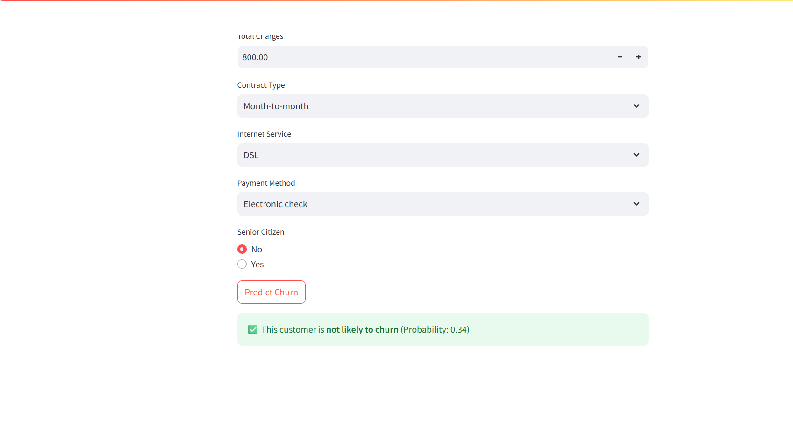

# 📉 Customer Churn Prediction System

<p align="center">


</p>

<p align="center">
An intelligent Machine Learning application that predicts whether a customer is likely to churn based on customer demographics, subscription details, and service usage patterns.
</p>

---

# 📖 Project Overview

The **Customer Churn Prediction System** is a Machine Learning-based web application developed using **Python**, **Scikit-learn**, and **Streamlit**.

The system analyzes customer information such as contract type, tenure, payment method, internet service, monthly charges, and total charges to predict whether a customer is likely to discontinue the service.

This project enables businesses to identify high-risk customers early and take proactive retention measures.

---

# ✨ Features

- 📊 Customer Churn Prediction
- 🤖 Machine Learning Classification Model
- 📈 Churn Probability Score
- ⚡ Instant Prediction Results
- 📋 Interactive Customer Information Form
- 💡 Business Decision Support
- 🖥️ User-Friendly Streamlit Interface
- 📉 Data-Driven Customer Retention Insights

---

# 🎯 Objectives

- Predict customers who are likely to churn.
- Improve customer retention strategies.
- Reduce business revenue loss.
- Assist decision-making using predictive analytics.
- Analyze customer behavior using historical data.

---

# 📊 Dataset

**Dataset:** Customer Churn Dataset

**Source:** Kaggle

### Dataset Includes

- Customer Demographics
- Customer Tenure
- Monthly Charges
- Total Charges
- Contract Type
- Internet Service
- Payment Method
- Senior Citizen Status

### Target Variable

- Churn
- Not Churn

---

# 🧠 Machine Learning Workflow

```
Customer Details
        │
        ▼
Data Preprocessing
        │
        ▼
Feature Encoding
        │
        ▼
Machine Learning Model
        │
        ▼
Prediction Probability
        │
        ▼
Likely to Churn / Not Likely to Churn
```

---

# 🛠️ Tech Stack

## Programming Language

- Python

## Machine Learning

- Scikit-learn

## Data Analysis

- Pandas
- NumPy

## Visualization

- Streamlit

## Model Serialization

- Joblib

## Version Control

- Git
- GitHub

---

# 📂 Project Structure

```text
Customer-Churn-Prediction/
│
├── app.py
├── model.pkl
├── encoder.pkl
├── scaler.pkl
├── requirements.txt
├── README.md
│
├── Screenshots/
│   ├── Customer churn prediction.png
│   └── Prediction.png
│
└── dataset/
```

---

# 📸 Application Screenshots

## 🏠 Customer Churn Prediction Form

<p align="center">

</p>

The application provides an interactive form where users can enter customer information such as:

- Tenure
- Monthly Charges
- Total Charges
- Contract Type
- Internet Service
- Payment Method
- Senior Citizen Status

After entering the details, users can instantly predict whether the customer is likely to churn.

---

## 📊 Prediction Result

<p align="center">

</p>

After clicking **Predict Churn**, the application displays:

- ✅ Churn Prediction
- 📈 Probability Score
- 💡 Easy-to-understand result indicating whether the customer is likely to churn or remain.

---

# 🚀 Installation

## Clone Repository

```bash
git clone https://github.com/bhargavi4470/Customer-churn-predicton.git

cd Customer-churn-predicton
```

---

## Install Dependencies

```bash
pip install -r requirements.txt
```

---

## Run the Application

```bash
streamlit run app.py
```

The application will launch in your browser at:

```
http://localhost:8501
```

---

# 📈 Prediction Workflow

```
Customer Input
       │
       ▼
Data Cleaning
       │
       ▼
Feature Encoding
       │
       ▼
Machine Learning Model
       │
       ▼
Probability Calculation
       │
       ▼
Prediction Result
```

---

# 💡 Future Enhancements

- 📊 Customer Analytics Dashboard
- ☁️ Cloud Deployment (AWS / Azure)
- 📈 Explainable AI (SHAP/LIME)
- 🤖 Deep Learning Models
- 📧 Customer Retention Alert System
- 📱 Mobile-Friendly Interface
- 🔍 Batch Customer Prediction

---

# 👩‍💻 Developed By

**Mangam Sai Ram Bhargavi**

**GitHub:**  
https://github.com/bhargavi4470


---

# ⭐ Support

If you found this project helpful, please consider giving it a ⭐ on GitHub.

Your support motivates future improvements and open-source contributions.

---
